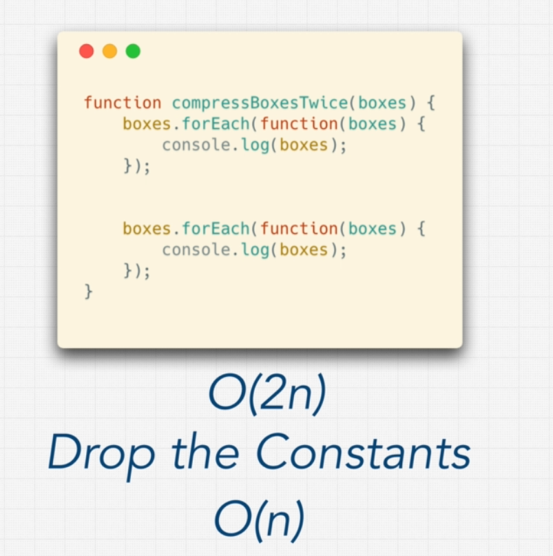
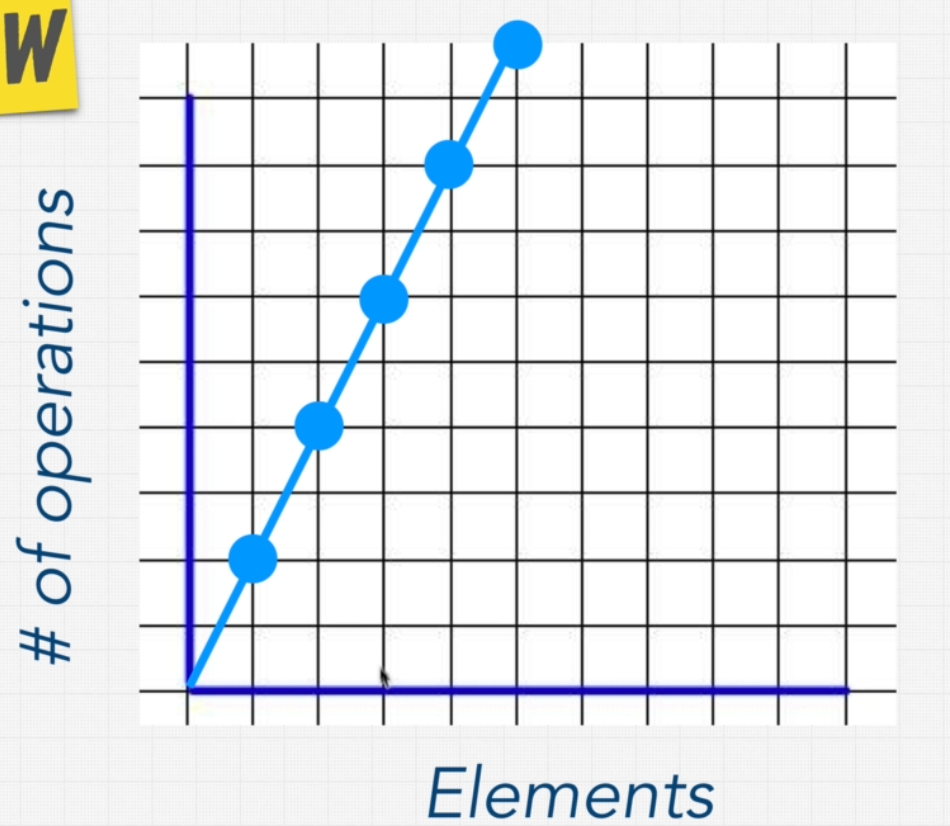
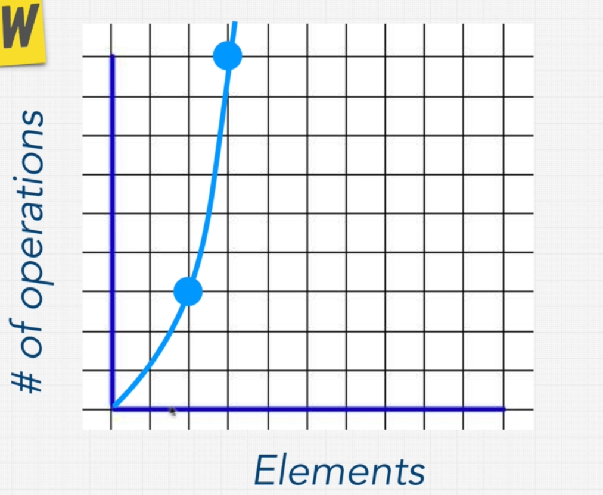
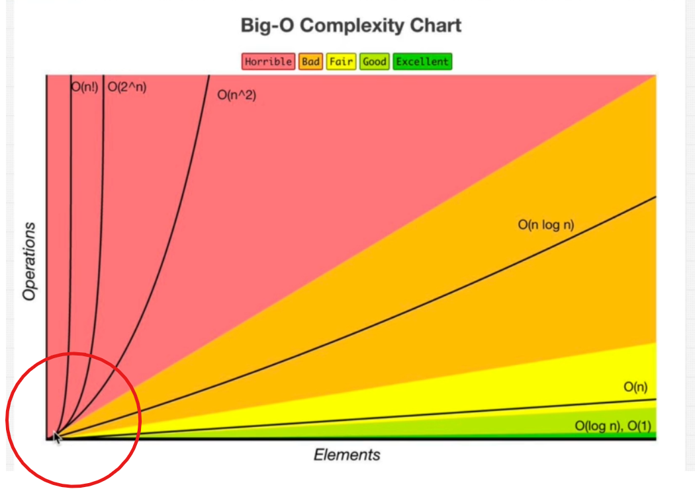
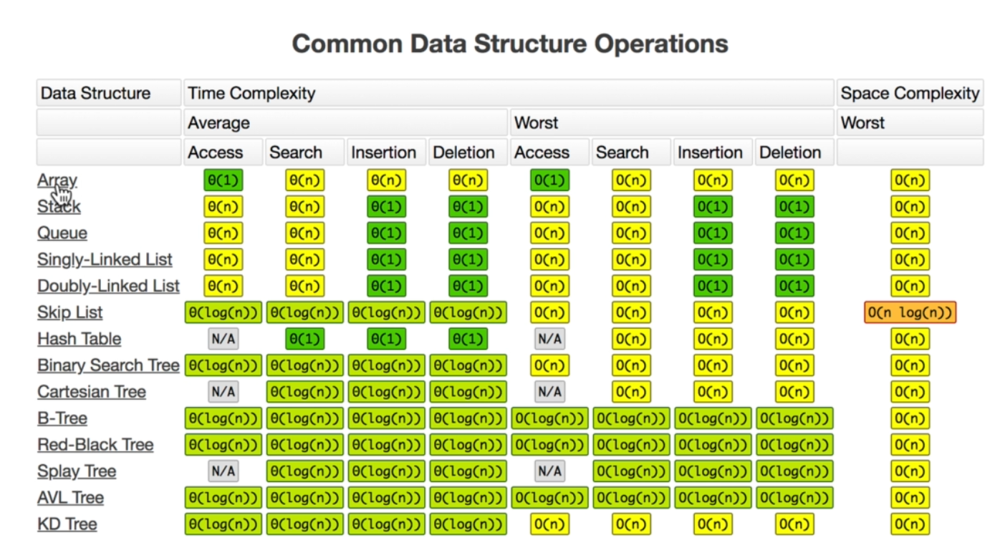

# Master-the-Coding-Interview: Data Strucutre + Algorithms

Master the Coding Interview: Data Structures + Algorithms BY Andrei Neagoie Founder of Zero to Mastery
## Table of contents
- [Master-the-Coding-Interview: Data Strucutre + Algorithms](#master-the-coding-interview-data-strucutre--algorithms)
  - [Table of contents](#table-of-contents)
  - [**Section 1: Introduction**](#section-1-introduction)
  - [**Section 2: Getting More Interviews**](#section-2-getting-more-interviews)
    - [Resume](#resume)
    - [Resume Cheetsheet](#resume-cheetsheet)
    - [What If I Don't Have Enough Experience?](#what-if-i-dont-have-enough-experience)
    - [Linkedin](#linkedin)
    - [Portfolio](#portfolio)
    - [Email](#email)
    - [Email Sample](#email-sample)
    - [Getting Email Extensions.](#getting-email-extensions)
    - [Where To Find Jobs?](#where-to-find-jobs)
    - [Resources for finding a Job.](#resources-for-finding-a-job)
    - [When should you start applying?](#when-should-you-start-applying)
  - [**Section 3: Big O**](#section-3-big-o)
    - [Setting Up Your Environment](#setting-up-your-environment)
    - [Section Overview](#section-overview)
    - [What Is Good Code?](#what-is-good-code)
    - [O(n) (Linear time)](#on-linear-time)
    - [O(1) (Constant time)](#o1-constant-time)
    - [Exercise: Big O Calculation](#exercise-big-o-calculation)
    - [Exercise: Big O Calculation 2](#exercise-big-o-calculation-2)
    - [Simplifying Big O](#simplifying-big-o)
    - [Big O Rule 1 - Worst Case](#big-o-rule-1---worst-case)
    - [Big O Rule 2 - Remove Constants](#big-o-rule-2---remove-constants)
    - [Big O Rule 3 - Different terms for inputs](#big-o-rule-3---different-terms-for-inputs)
    - [O(n^2)](#on2)
    - [Big O Rule 4 - Drop Non Dominants](#big-o-rule-4---drop-non-dominants)
    - [Big O Cheatsheet.](#big-o-cheatsheet)
    - [What Does This All Mean?](#what-does-this-all-mean)
    - [O(n!)](#on)
    - [3 Pillars Of Programming](#3-pillars-of-programming)


## **Section 1: Introduction**

[Interview Mind Map](https://coggle.it/diagram/W5u8QkZs6r4sZM3J/t/master-the-interview)

- Getting the Interview
- Big O Notation
- Technical Interviews
- Non Technical Interviews
- Offer + Negotiation

[Technical Interview Mind Map](https://coggle.it/diagram/W5E5tqYlrXvFJPsq/t/master-the-interview-click-here-for-course-link)

- Data Structures
- Algorithms

Fast Track

- Getting The Interview
- Non Technical Interview
- Offer + Negotiation

Complete

- Everything

Tech Track

- Big O
- How To Solve Problems
- Data Structures
- Algorithms
- Extra Coding Exercises

**[⬆ back to top](#table-of-contents)**


## **Section 2: Getting More Interviews**

- Resume
- LinkedIn
- Portfolio
- Email

**[⬆ back to top](#table-of-contents)**

### Resume

Resources

- [ResumeMaker.Online](https://www.resumemaker.online/)
- [Resume Cheat Sheet](https://github.com/aneagoie/resume-checklist)
- [Jobscan](https://www.jobscan.co/)
- [Engineering Resume Templates](https://www.cakeresume.com/Engineering-resume-samples)
- [This resume does not exist](https://thisresumedoesnotexist.com/)

Resume

- One Page
- Relevant Skills
- Personalized
- Online Link


### Resume Cheetsheet

✅ Use a pre-designed resume template    
✅ Make the resume fit on 1 page   
✅ Include words from job description  
✅ Include company name you are applying to  
✅ Does your first item on your resume reflect what they are looking for?  
✅ Experience titles demonstrate value  
✅ Do you have an online link?  
✅ Remove the word “I” 
✅ No buzzwords describing how great you are  
✅ Are you using Action words?  
✅ Measure everything in terms of impact, don’t just describe your responsibilities  
✅ Technical Knowledge/Skills should include what they are looking for. Only show years if it is impressive  
✅ Include only sections/items that are impressive: Experience, Projects, Education, Technical Skills  
✅ No typos or bad grammar  


**[⬆ back to top](#table-of-contents)**

### What If I Don't Have Enough Experience?

[Creative Tim](https://www.creative-tim.com/)
[Free HTML templates](http://www.mashup-template.com/)
[Medium](https://medium.com/)


- _Experience doen't come just from working at another company._
- **Maintain GITHUB graph.**
- **Make your own website.**
- **1 ~ 2 Big projects.**
- Instead of spending time on small little projects spend your time on one or two big projects 
- On those projects you will cover the mostly imortant concepts.
- Recruiter just care about that you build things that are real, big and complicated and you solved hard problems.
- Show those projects on your resume work experience section and mention what you've done in that.
- **Blog Post.** (medium.com)

**[⬆ back to top](#table-of-contents)**

### Linkedin
- Update the linkedin profile with the skills you have and according to the jobs that you're targetting.
- Include relevant skills and keywords.
- Find a people, connect and message or get referals of those companies in which you want to work.
- Update your linkedin profile after few days when you're searching for a job.
  

**[⬆ back to top](#table-of-contents)**

### Portfolio

- [Creative Tim](https://www.creative-tim.com/)
- [HTML5/CSS3 Free Templates](http://www.mashup-template.com/templates.html)
- [ZtM-Job-Board](https://github.com/zero-to-mastery/ZtM-Job-Board)
- [Landing page templates for startups](https://cruip.com/)
- [Free Bootstrap Templates & Themes](https://mdbootstrap.com/freebies/)
- [15 Web Developer Portfolios to Inspire You](https://www.freecodecamp.org/news/15-web-developer-portfolios-to-inspire-you-137fb1743cae/)

**[⬆ back to top](#table-of-contents)**

### Email
- Ask people in the company for referral.
- Meet them, or message them, meet people in Meetups
- People love talking about themselve, ask CTOs, lead developers and professionals for a chat in office or coffer & let them know you're interested in getting where they are professionally and _learn from them_.
- The key in above mention point is just not ask him for a job.
- Try to bypass the formalities in application process by trying to get in interview right away.

**[⬆ back to top](#table-of-contents)**
### Email Sample
Hey $BOB,
I saw your presentation at $CONFERENCE last year on Youtube (rr point to some work they have done).
Great stuff; loved what you did with $FOO, in particular
$COMMENT_PROVING_YOU_KNOW_WHAT_YOU'RE_TALKING_ABOUT.
I'm also a $FOO developer. I noticed that your company is hiring
or $ROLE. I’d love to be a part of your team. Do you have a
few minutes to chat on Thursday about what you guys are doing?

Thanks,
Yourname
Your website or any public profile link.

**[⬆ back to top](#table-of-contents)**
### Getting Email Extensions.
- [Hunter - Email Finder Extension
](https://chrome.google.com/webstore/detail/hunter-email-finder-exten/hgmhmanijnjhaffoampdlllchpolkdnj?hl=en)
- [Find anyone's email - Contact Out](https://chrome.google.com/webstore/detail/find-anyones-email-contac/jjdemeiffadmmjhkbbpglgnlgeafomjo?hl=en)
- [Email Extractor](https://chrome.google.com/webstore/detail/email-extractor/jdianbbpnakhcmfkcckaboohfgnngfcc?hl=en)

**[⬆ back to top](#table-of-contents)**
### Where To Find Jobs?

- Getting an interview is a number game, for getting a interview you need to apply 50 places.
- Just applying to companies blindly is not a good idea.
- If you have companies you love or you want to work for a specific company and targetting your approach and focus is a lot better more efficient way of spending your time.

### Resources for finding a Job.
[Resources for jobs](resourcesForJobs.html)

### When should you start applying?
- **Now.**
- If you're applying to a job where you check all the requirements check boxes and you know everything then that means you are getting a where job where you already know what to do. _You won't grow in this world._
- A job description is simply a guideline of what type of work you will be doing not what type of work have you done in the past.
- Giving interview use as practice just like with anything.
- Remember, **_IF YOU NEVER ASK, THE ANSWER IS ALWAYS NO._** So start applying now.

**[⬆ back to top](#table-of-contents)**

## **Section 3: Big O**

### Setting Up Your Environment

- [Repl.it](https://repl.it/)
- [glot.io](https://glot.io/)
- [RunJS](https://runjs.dev/)

**[⬆ back to top](#table-of-contents)**

Python, C/C++, Golang, Swift and JavaScript Solutions!

- [Python](https://github.com/theja-m/Data-Structures-and-Algorithms)
- [C/C++](https://github.com/shree1999/Data-Structures-and-Algorithms)
- [Golang](https://github.com/punitpandey/DS-Algo)
- [Swift](https://github.com/preetamjadakar/datastructures-swift)

**[⬆ back to top](#table-of-contents)**

### Section Overview
- Most important topics for any Software developer or Engineer.
- Even if you're coding 10 years later from now this is a concept that will be around for a long time.
- That will make truly make you a better developer.
- Without Big-O you cannot encouter Big companies interviews like Google, Facebook, Alibaba, Amazon OR FAANG.
- Big-O and official term is Big-O _asymptomatic analysis_.
- Any coder given enough time can solve a problem. What matters is though how well the problem is solved. And this is where Big-O can help us.
- Big-O can tell us how well a problem is solved.
- WIth Big-O we can distinguish Good code and bad code.
- This topic will come again and again.


**[⬆ back to top](#table-of-contents)**


### What Is Good Code?

What Is Good Code?

- Readable
- Scalable [Big O]
  - **Question:** How can we measure the good and bad code?
  - **Answer :** Big-O notation is the language we use for talking about how long an algorithm takes to run.
  - **X-axis:** Elements/Inputs, **y-axis:** Operations
  - Excellent, Good: O(log n), O(1)
  - Fair: O(n)
  - Bad: O(nlog n)
  - Horrible: O(n^2), O(2^n), O(n!)

_When we talk about Big-O and scalability of code we simply mean when we grow bigger and bigger with our input, how much does the algorithm or function slow down. The less it slows down the better it is._

Big O


- [Know The Complexities](https://www.bigocheatsheet.com/)
- [Big O Algorithm Complexity](big-o-complexity.pdf)
- [Big O Cheat Sheet](big-o-cheatsheet.pdf)
- [What is the difference between big oh, big omega and big theta notations?](https://www.quora.com/What-is-the-difference-between-big-oh-big-omega-and-big-theta-notations)

**[⬆ back to top](#table-of-contents)**


### O(n) (Linear time)

- Linear rate - As our number of inputs increase the number of operations as well.
- **Keep in mind,** Big-O doesn't measure things in **seconds** instead focusing on **how quickly our runtime grows**. By simply using the size of input (n) and compare to the number of operations that increase.
- Scalability means, as things grow larger and larger does it scale?


```javascript
// O(n): Linear time
const fish = ['dory', 'bruce', 'marlin', 'nemo']
const nemo = ['nemo']
const everyone = [
  'dory',
  'bruce',
  'marlin',
  'nemo',
  'gill',
  'bloat',
  'nigel',
  'squirt',
  'darla',
  'hank',
]
const large = new Array(100000).fill('nemo')

const findNemo = (fish) => {
  let t0 = performance.now()
  for (let i = 0; i < fish.length; i++) {
    if (fish[i] === 'nemo') {
      console.log('Found NEMO!')
    }
  }
  let t1 = performance.now()
  console.log('Call to find Nemo took ' + (t1 - t0) + ' milliseconds.')
}

findNemo(large) // O(n) --> linear time
```

Compression Example.


**[⬆ back to top](#table-of-contents)**


### O(1) (Constant time)

- O(1) is Excellent in Complexity chart.
- No matter how much input grows, the number of operations remains same.


```javascript
// O(1): Constant time
const boxes = [0, 1, 2, 3, 4, 5]

const logFirstTwoBoxes = (boxes) => {
  console.log(boxes[0])	// O(1)
  console.log(boxes[1])	// O(1)
}

logFirstTwoBoxes(boxes) // O(2)
```

**[⬆ back to top](#table-of-contents)**


### Exercise: Big O Calculation

- Assignment takes constant.

```javascript
// What is the Big O of the below function?
// Hint, you may want to go line by line
const funChallenge = (input) => {
  let a = 10 // O(1)
  a = 50 + 3 // O(1)

  for (let i = 0; i < input.length; i++) {
    anotherFunction() // O(n)
    let stranger = true // O(n)
    a++ // O(n)
  }
  return a // O(1)
}

// 1 + 1 + 1 + n + n + n
// Big O(3 + 3n)
// O(n)
funChallenge()
```

**[⬆ back to top](#table-of-contents)**


### Exercise: Big O Calculation 2

```javascript
// What is the Big O of the below function? 
// (Hint, you may want to go line by line)
const anotherFunChallenge = (input) => {
  let a = 5 //O(1)
  let b = 10 //O(1)
  let c = 50 //O(1)
  for (let i = 0; i < input; i++) {
    let x = i + 1 //O(n)
    let y = i + 2 //O(n)
    let z = i + 3 //O(n)
  }
  for (let j = 0; j < input; j++) {
    let p = j * 2 //O(n)
    let q = j * 2 //O(n)
  }
  let whoAmI = "I don't know" //O(1)
}

// Big O(4 + 5n)
// Big O(n)
anotherFunChallenge(5)
```

**[⬆ back to top](#table-of-contents)**

### Simplifying Big O

Rule Book

1. Worst Case
2. Remove Constants
3. Different terms for inputs
4. Drop Non Dominants

**[⬆ back to top](#table-of-contents)**


### Big O Rule 1 - Worst Case

- We'll always care about worst case, even if result in initial loops.

```javascript
// Worst Case: n
const fish = ['dory', 'bruce', 'marlin', 'nemo']
const nemo = ['nemo']
const everyone = [
  'dory',
  'bruce',
  'marlin',
  'nemo',
  'gill',
  'bloat',
  'nigel',
  'squirt',
  'darla',
  'hank',
]
const large = new Array(100000).fill('nemo')

const findNemo = (fish) => {
  let t0 = performance.now()
  for (let i = 0; i < fish.length; i++) {
    console.log('running')
    if (fish[i] === 'nemo') {
      console.log('Found NEMO!')
      break
    }
  }
  let t1 = performance.now()
  console.log('Call to find Nemo took ' + (t1 - t0) + ' milliseconds.')
}

findNemo(large)
```

**[⬆ back to top](#table-of-contents)**


### Big O Rule 2 - Remove Constants

- Remeber, drop the constants.
- You're never going to really see the numbers in Big O notation.



**_To prove that, if we look at at this function in our graph we see that the elements as the elements increase_**


- 2 elements 2 operations, 4 elements 4 operations, 6 elements 6 operations.
- Even though line is increasing, the way line is increases still linear, That's the key.
- In Big O we don't care about how steep the line is, we care about how the line moves as our inputs increase.


```javascript
// Big O(1 + n/2 + 100)
// Big O(n/2 + 101)
// Big O(n/2)
// Big O(n)
const printFirstItemThenFirstHalfThenSayHi100Times = (items) => {
  // O(1)
  console.log(items[0])

  const middleIndex = Math.floor(items.length / 2)
  const index = 0

  // O(n/2)
  while (index < middleIndex) {
    console.log(items[index])
    index++
  }

  // O(100)
  for (let i = 0; i < 100; i++) {
    console.log('hi')
  }
}
```

**[⬆ back to top](#table-of-contents)**


### Big O Rule 3 - Different terms for inputs

- Both input lenght can be vary that's why it's O(a + b)
- Different input should have different variables.

```javascript
// boxes, boxes2 are 2 different terms for inputs
// Big O(a + b)
const compressBoxesTwice = (boxes, boxes2) => {
  boxes.forEach((box) => console.log(box)) // O(a)
  boxes2.forEach((box) => console.log(box)) // O(b)
}

compressBoxesTwice([1, 2, 3], [4, 5])
```

**[⬆ back to top](#table-of-contents)**


### O(n^2)

- O (n ^ 2) - Quadratinc time.
- O (n ^ 2) is Horrible.
- When loops are one after another we use addition e.g. O(n + n). And when loops are nested, we use multiplication e.g. O(n * n) OR O(n^2).



- Every time the number of elements increase, number of operations increase quadratically.
- In above example, when number of elements is 2 then number of operations is 3. When one element increase e.g. 3, the number of operation icreases to 9 OR 3^2. 
- Lot of interview questions that ask you to solve a problem initially is O(n^2) and make it faster by perhaps making it into something that in a bit lower e.g. BAD or FAIR.


```javascript
// Big O(a * b) - Quadratic Time
const boxes = ['a', 'b', 'c', 'd', 'e']
const logAllPairsOfArray = (array) => {
  for (let i = 0; i < array.length; i++) {
    // O(a)
    for (let j = 0; j < array.length; j++) {
      // O(b)
      console.log(array[i], array[j])
    }
  }
}

logAllPairsOfArray(boxes)
```

**[⬆ back to top](#table-of-contents)**


### Big O Rule 4 - Drop Non Dominants

- Drop non dominant terms, just remain those terms which are impactful e.g. O(n + n^2) _n^2_ is the way more important than the _n_ because _n^2_ is impacting more.
- We always just keep the dominant term.
- Another example: O(x^2 + 2 + 3x + 100 + x/2) here we just keep O(x^2).

```javascript
// Big O(n + n^2)
// Drop Non Dominants -> Big O(n^2)
const printAllNumbersThenAllPairSums = (numbers) => {
  // O(n)
  console.log('these are the numbers:')
  numbers.forEach((number) => console.log(number))

  // O(n^2)
  console.log('and these are their sums:')
  numbers.forEach((firstNumber) =>
    numbers.forEach((secondNumber) => console.log(firstNumber + secondNumber))
  )
}

printAllNumbersThenAllPairSums([1, 2, 3, 4, 5])
```

**[⬆ back to top](#table-of-contents)**

### Big O Cheatsheet.

_To download cheatsheet click below._

[Big O Algorithm Complexity](big-o-complexity.pdf)

**[⬆ back to top](#table-of-contents)**

### What Does This All Mean?

- Scalable means we worry about large inputs.
- If our function is only worry about really small inputs OR we know that our input are going to be only an array of five items, **Big O won't matter as much.**.
- See below image, if our input are small all these lines are bunch up together which means Big O won't affect on small inputs as much, but it's not real life.


- When we write code, we want to write code that can scale so that we don't have to constantly go back and fix things Or when things get out of hand the code breaks.
- That's why Big-O is so important to write scalable code.
- In Javascript we have array methods e.g. push, pop, shift, unshift. All these methods which are functions have a cost associated with them.
- Example:  When we search in an array or access first item in array it's O(1) but when we use **unshift** it turns out to be O(n).
- We use Big-O to measure why one Data structure might be better than others. Why should we use an array instead of object. Maybe object has better functions what we need for our data.
- For better understanding of different operations of different Data Structures see below image. We have different Big-O notations for different Data Structures.



- In above image, some DS have really good Big O for searching. Some DS good in deletion, insertion etc. Each DS have different pros and cons.
- **_DS are simply ways to store data and algorithms are simply functions or ways to use Data Structures to write our programs. Instructions for our machines._**
- **Data Structures + Algorithms = Programs**
- Great programmers have this knowledge where they pick the right data structure, right algorithm to write good programs.
- In this section we lay our foundation for finding what is a good solution to a problem and what is a bad.
- Most interviews have this core concept, what's the right data structure, what's the right algorithm to write good programs.
- Google hires engineers and developers that know this, because they have a lot  of scale that they have to think about, alot of inputs. And people know how to handle these programs are the ones that are going to be able to build great programs.
- It's too much, but it Worths. 😛🌠

**[⬆ back to top](#table-of-contents)**

### O(n!)

- If you're writing code that has this Big O notation you're definitely doing something wrong.
- It's the most expensive one and it's the steepest of them all in chart. 
- This is called **Factorial time**.
- It means that we're adding a nested loop for every input that we have.

[Example of O(n!)?](https://stackoverflow.com/questions/3953244/example-of-on)

**[⬆ back to top](#table-of-contents)**

### 3 Pillars Of Programming

What is good code?

1. Readable
2. Scalable - Speed (Time Complexity)
3. Scalable - memory (Space Complexity)

**[⬆ back to top](#table-of-contents)**